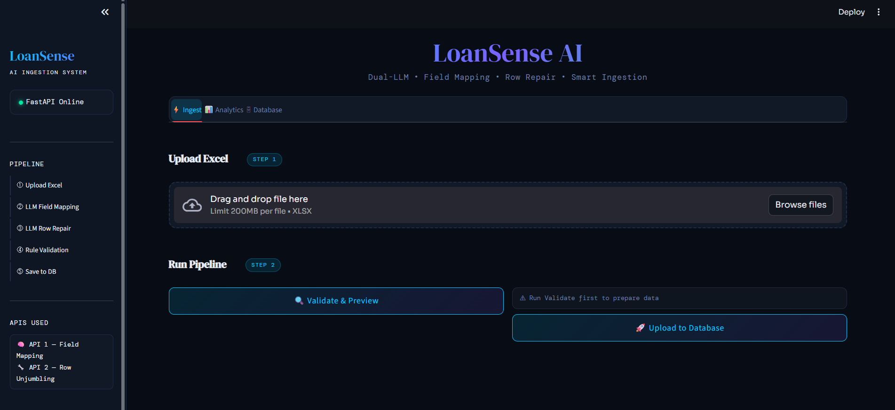

# 🏦 LoanSense AI — Dual-LLM Loan Applicant Ingestion System

<div align="center">


**An intelligent data ingestion pipeline that uses two LLMs in sequence — one to detect column mappings, another to unjumble scrambled row data — before saving clean records to MySQL.**

</div>

---

## 📸 Screenshots

### Dashboard — Before vs After Preview


---

## ✨ What It Does

Loan applicant Excel files often arrive with:
- **Jumbled columns** — phone numbers in the email column, names in the ID column
- **Mixed-up values** — Aadhaar in the PAN field, loan amount where income should be
- **Inconsistent headers** — `Full Name`, `Name`, `Applicant`, `Customer` all meaning the same thing

LoanSense AI fixes all of this automatically using a **two-stage LLM pipeline**:

| Stage | API | Job |
|-------|-----|-----|
| **Stage 1** | Field Mapping LLM | Detects which Excel column maps to which DB field |
| **Stage 2** | Row Repair LLM (Langfuse/sneha1) | Unjumbles each row — assigns values to correct fields by format |
| **Stage 3** | Rule Engine | Final validation pass — format checks, range checks, ID assignment |

---

## 🏗️ Architecture

```
┌─────────────────────────────────────────────────────────┐
│                    Streamlit Dashboard                   │
│          (app.py — Dark Luxury Fintech UI)               │
└────────────────────────┬────────────────────────────────┘
                         │ HTTP
┌────────────────────────▼────────────────────────────────┐
│                   FastAPI Backend                        │
│                     (main.py)                            │
│                                                          │
│  ┌──────────────┐   ┌──────────────┐   ┌─────────────┐  │
│  │  /validate/  │   │/upload-      │   │  /stats/    │  │
│  │              │   │validated/    │   │             │  │
│  └──────┬───────┘   └──────┬───────┘   └─────────────┘  │
│         │                  │                             │
│  ┌──────▼───────────────── ▼──────────────────────────┐  │
│  │              Pipeline (run_pipeline)                │  │
│  │                                                     │  │
│  │  1. call_llm_mapping()  ──► API 1 (Field Mapping)  │  │
│  │  2. call_llm_repair()   ──► API 2 (Langfuse sneha1)│  │
│  │  3. validate_and_fix()  ──► Rule Engine            │  │
│  └─────────────────────────────────────────────────────┘  │
└────────────────────────┬────────────────────────────────┘
                         │ SQLAlchemy
              ┌──────────▼──────────┐
              │    MySQL Database   │
              │  loan_applicants    │
              └─────────────────────┘
```

---

## 📁 Project Structure

```
loansense-ai/
│
├── main.py                  # FastAPI backend — dual LLM pipeline
├── app.py                   # Streamlit dashboard — dark luxury UI
├── .env                     # Environment variables (not committed)
├── .env.example             # Template for environment variables
├── requirements.txt         # Python dependencies
├── README.md                # This file
│
└── assets/                  # Screenshots for README
    ├── dashboard_preview.png

```

---

## 🔧 Tech Stack

| Layer | Technology |
|-------|-----------|
| **Frontend** | Streamlit + Custom CSS (Dark Fintech Theme) |
| **Backend** | FastAPI |
| **Database** | MySQL via SQLAlchemy |
| **LLM 1** | Dvara Gateway — Field Mapping |
| **LLM 2** | Dvara Gateway → Langfuse → Gemini 2.5 Flash |
| **Prompt Mgmt** | Langfuse (prompt versioning + config) |
| **Fonts** | DM Serif Display · Sora · DM Mono |

---

## ⚙️ Setup & Installation

### 1. Clone the Repository

```bash
git clone https://github.com/YOUR_USERNAME/loansense-ai.git
cd loansense-ai
```

### 2. Create Virtual Environment

```bash
python -m venv venv
source venv/bin/activate        # Mac/Linux
venv\Scripts\activate           # Windows
```

### 3. Install Dependencies

```bash
pip install -r requirements.txt
```

### 4. Configure Environment Variables

```bash
cp .env.example .env
```

Edit `.env`:

```env
# Database
DB_USER=root
DB_PASSWORD=yourpassword
DB_HOST=localhost
DB_PORT=3306
DB_NAME=loan_db

# API 1 — Field Mapping LLM
API_URL=https:/api/YOUR_MAPPING_ENDPOINT

# API 2 — Row Unjumbling (Langfuse/sneha1)
REPAIR_API_URL=https:/api/YOUR_REPAIR_ENDPOINT


# Shared Bearer Token
TOKEN=your_token_here
```

### 5. Set Up MySQL Database

```sql
CREATE DATABASE loan_db;
```

> The table `loan_applicants` is auto-created on first run.

### 6. Run the Application

```bash
# Terminal 1 — Start FastAPI backend
uvicorn main:app --reload --port 8000

# Terminal 2 — Start Streamlit dashboard
streamlit run app.py --server.port 8501
```

Open → [http://localhost:8501](http://localhost:8501)

---

## 🚀 How to Use

### Step 1 — Upload Excel
Drop your Excel file (`.xlsx`) on the **Ingest** tab. Any column naming convention is supported — LLM figures it out.

### Step 2 — Validate & Preview
Click **🔍 Validate & Preview**. The pipeline runs:
- **API 1** detects field mappings
- **API 2** unjumbles each row by value format
- Rule engine does a final validation pass

You get:
- Field mapping table (Excel col → DB field)
- Per-field quality score bars
- Before / After side-by-side preview
- Downloadable cleaned Excel

### Step 3 — Upload to Database
Click **🚀 Upload to Database**. Uses the already-validated data from Step 2 — **no re-processing**. Shows inserted vs updated counts.

---

## 🗄️ Database Schema

```sql
CREATE TABLE loan_applicants (
    applicant_id    VARCHAR(50)    PRIMARY KEY,   -- e.g. A107
    applicant_name  VARCHAR(255),
    phone_number    VARCHAR(20),                  -- 10 digits, starts 6-9
    email           VARCHAR(255),
    aadhaar_number  VARCHAR(20),                  -- 12 digits
    pan_number      VARCHAR(20),                  -- ABCDE1234F format
    loan_amount     DECIMAL(12,2),               -- 5L – 1Cr
    loan_purpose    VARCHAR(255),                 -- education/car/medical etc.
    employment_type VARCHAR(100),                 -- salaried/self employed etc.
    monthly_income  DECIMAL(12,2),               -- 25K – 10L
    created_at      TIMESTAMP DEFAULT CURRENT_TIMESTAMP
);
```
---

## ✅ Validation Rules

| Field | Rule |
|-------|------|
| `applicant_id` | Must match `A\d+` (e.g. A107) — auto-assigned if missing |
| `applicant_name` | Letters only, min 1 word |
| `phone_number` | 10 digits, starts with 6/7/8/9 |
| `email` | Standard email format |
| `aadhaar_number` | Exactly 12 digits |
| `pan_number` | `ABCDE1234F` pattern |
| `loan_amount` | ₹5,00,000 – ₹1,00,00,000 |
| `monthly_income` | ₹25,000 – ₹10,00,000 |
| `loan_purpose` | One of 6 allowed values |
| `employment_type` | One of 3 allowed values |

---

## 📊 API Endpoints

| Method | Endpoint | Description |
|--------|----------|-------------|
| `GET` | `/` | Health check |
| `POST` | `/validate/` | Run full pipeline, return preview |
| `POST` | `/upload-validated/` | Save pre-validated rows to DB |
| `POST` | `/upload/` | Full pipeline + save (fallback) |
| `GET` | `/stats/` | DB aggregates for analytics tab |

---

## 📦 requirements.txt

```
fastapi
uvicorn
streamlit
pandas
openpyxl
sqlalchemy
pymysql
python-dotenv
requests
```

---

## 👩‍💻 Author

**Sneha Hanji** 
Built as an internal AI data ingestion tool for loan applicant processing.

---

## 📄 License

Internal use only © 2026
